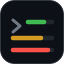
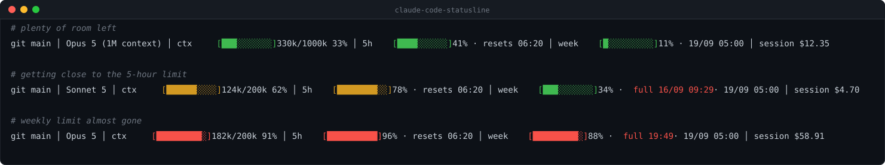
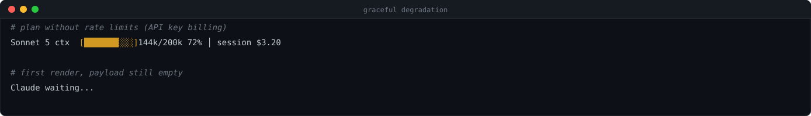

<div align="center">



# claude-code-statusline

**O uso real do seu plano na statusline do Claude Code.**<br>
Os mesmos números do `/usage` — sem estimativa, sem chute, sem subir processo a cada desenho da barra.

[](https://github.com/regisdias/claude-code-statusline/actions/workflows/ci.yml)
[](LICENSE)
[](https://claude.com/claude-code)
[](#requisitos)
[](https://github.com/regisdias/claude-code-statusline/stargazers)

[🇬🇧 English](README.md) · 🇧🇷 **Português**



</div>

---

## Instalação

**Linux · WSL · macOS · Git Bash**

```bash
curl -fsSL https://raw.githubusercontent.com/regisdias/claude-code-statusline/main/install.sh | bash
```

O instalador põe o script em `~/.claude`, configura o `~/.claude/settings.json` (fazendo backup antes e
nunca sobrescrevendo uma `statusLine` que já exista) e mostra uma prévia. Prefere fazer na mão? Veja a
[instalação manual](#instalação-manual).

**Windows (PowerShell)**

```powershell
iwr https://raw.githubusercontent.com/regisdias/claude-code-statusline/main/statusline-command.ps1 `
  -OutFile "$env:USERPROFILE\.claude\statusline-command.ps1"
```

Depois, no `%USERPROFILE%\.claude\settings.json`:

```json
{
  "statusLine": {
    "type": "command",
    "command": "powershell -NoProfile -ExecutionPolicy Bypass -File %USERPROFILE%\\.claude\\statusline-command.ps1"
  }
}
```

No PowerShell 7, troque `powershell` por `pwsh`. Usa o Claude Code **dentro do WSL**? Siga a instalação
de Linux: o lado WSL tem o seu próprio `~/.claude`.

> [!IMPORTANT]
> Mantenha o `.ps1` em **UTF-8 com BOM**. O Windows PowerShell 5.1 lê arquivo sem BOM como ANSI e os
> caracteres de bloco quebram o parser. Baixando como acima, o BOM vem junto; se for editar, salve como
> "UTF-8 com BOM".

A barra aparece no próximo desenho, sem reiniciar nada.

## O que aparece

```
Opus 5 (1M context)  ctx [███░░░░░░░] 330k/1000k 33%  │  5h [████░░░░░░] 41% · reseta 06:20  │  semana [█░░░░░░░░░] 11% · 18/09 05:00  │  sessão $12.35
```

| Trecho | O que é |
|---|---|
| `ctx` | Janela de contexto da conversa atual. É local: não tem relação com a cota do plano. |
| `5h` | Bloco de 5 horas do plano, e a hora em que zera. |
| `semana` | Limite semanal do plano, e quando zera. |
| `sessão` | Custo desta conversa, em dólar. |

As barras ficam **verdes** até 60%, **amarelas** até 85% e **vermelhas** acima disso.

## Por que não usar barra baseada em custo

A maioria das statuslines chama um estimador de uso: ele lê os arquivos de transcrição locais, converte
os tokens em dólar pela tabela pública da API e divide por um teto calibrado na mão. Duas coisas dão
errado.

**Antes** — estimado, e errado:

```
ctx [███░░░░░░░] 33%   │   plano [███████████] 112%     ← o /usage dizia 41%
```

**Depois** — direto do payload:

```
ctx [███░░░░░░░] 33%   │   5h [████░░░░░░] 41%          ← o número que o servidor reporta
```

- **A barra passa de 100%** quando o teto calibrado na mão fica abaixo da cota real. Num caso medido, ela
  marcava 112% enquanto o `/usage` dizia 41%.
- **Sessão longa infla a estimativa:** leitura de cache pesa pouco na cota e muito na conta em dólar.

O Claude Code 2.1.251+ manda `rate_limits.five_hour` e `rate_limits.seven_day` (porcentagem e
`resets_at`) no payload da statusline — o número real está a uma leitura de JSON de distância. Sem
subprocesso, sem ler transcrição, sem calibragem.

## Degrada, mas não quebra

Campo que falta derruba só o seu trecho e mantém o resto. Payload malformado imprime `aguardando...` em
vez de despejar um stack trace no seu terminal.

<div align="center">

</div>

## Requisitos

| | |
|---|---|
| **Claude Code** | 2.1.251 ou mais novo (`claude --version`) — versões anteriores desenham só a barra `ctx` |
| **Versão shell** | `bash`, `jq`, `awk` — Linux: `apt install jq` · macOS: `brew install jq` |
| **Versão PowerShell** | nada além do Windows PowerShell 5.1, que já vem no Windows |

Duas implementações, com saída idêntica byte a byte:

| Arquivo | Para |
|---|---|
| [`statusline-command.sh`](statusline-command.sh) | Linux, WSL, macOS e Git Bash |
| [`statusline-command.ps1`](statusline-command.ps1) | Claude Code rodando direto no Windows |

## Instalação manual

```bash
curl -fsSL https://raw.githubusercontent.com/regisdias/claude-code-statusline/main/statusline-command.sh \
  -o ~/.claude/statusline-command.sh
chmod +x ~/.claude/statusline-command.sh
```

No `~/.claude/settings.json`:

```json
{
  "statusLine": {
    "type": "command",
    "command": "bash ~/.claude/statusline-command.sh"
  }
}
```

## Testar sem abrir o Claude Code

Jogue qualquer payload de [`scripts/payloads/`](scripts/payloads) na entrada:

```bash
bash statusline-command.sh < scripts/payloads/verde.json       # verde
bash statusline-command.sh < scripts/payloads/vermelho.json    # vermelho
```

```powershell
Get-Content scripts\payloads\verde.json | powershell -NoProfile -File .\statusline-command.ps1
```

Para conferir se as duas implementações continuam batendo, e se o `.ps1` manteve o BOM:

```bash
bash scripts/testar.sh
```

## Se algo não aparecer

| Sintoma | Causa |
|---|---|
| Só a barra `ctx` aparece | Claude Code anterior ao 2.1.251, ou plano sem limite de cota (cobrança por API key). |
| `aguardando...` | O payload veio vazio, ou falta o `jq` (versão shell). |
| Os blocos viram `?` no Windows | O terminal não está em UTF-8. O Windows Terminal resolve; o console antigo pode não. |
| Erro de parser no PowerShell | O `.ps1` perdeu o BOM UTF-8. Baixe de novo. |
| Sem cores | O terminal está removendo os códigos ANSI. |
| Hora do reset errada | Fuso do seu computador: o script formata o epoch com o relógio local. |

Continua travado? [Abra uma issue](https://github.com/regisdias/claude-code-statusline/issues/new/choose).

## Contribuindo

Pull requests são bem-vindos — veja o [CONTRIBUTING.md](CONTRIBUTING.md). A regra que importa: **as duas
implementações têm de imprimir os mesmos bytes para o mesmo payload**, e mudança de formato entra nas
duas no mesmo commit.

- [Relatar um bug](https://github.com/regisdias/claude-code-statusline/issues/new?template=bug_report.yml)
- [Pedir uma melhoria](https://github.com/regisdias/claude-code-statusline/issues/new?template=feature_request.yml)
- [Política de segurança](SECURITY.md) · [Código de conduta](CODE_OF_CONDUCT.md) · [Changelog](CHANGELOG.md)

## Licença

[MIT](LICENSE) © Regis Dias

<div align="center">
<sub>Se isso te salvou de bater no limite sem perceber, uma ⭐ ajuda outras pessoas a acharem o projeto.</sub>
</div>
